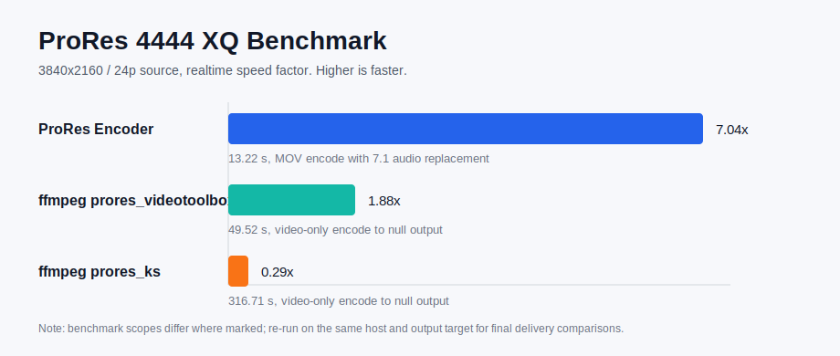
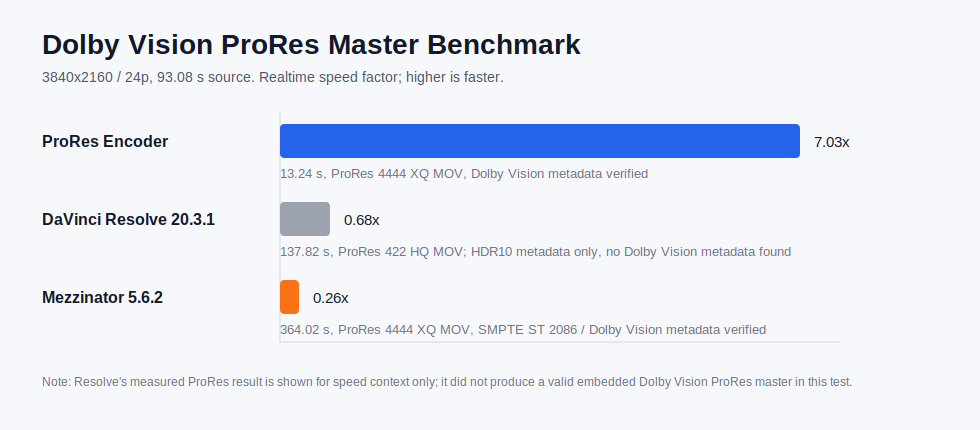
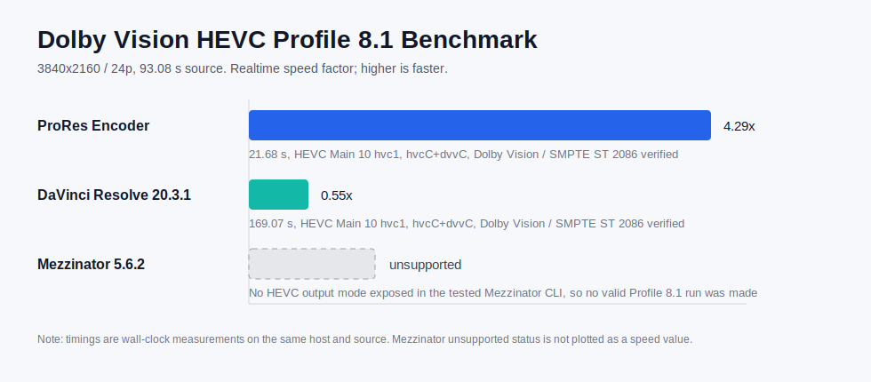

# ProRes Encoder 1.2.0

Native macOS CLI and Framework for ProRes, HEVC, AV1, Dolby Vision, HDR color
conversion, CMU analysis, MOV/MXF mastering, linked AAF, and timeline workflows.
All MOV codecs—including AV1—are muxed as QuickTime `.mov`; the encoder does
not create MP4 containers or elementary-stream output files.

## What’s New in 1.2.0

- Native SVT-AV1 Main 10 encoding in QuickTime MOV.
- Native HEVC Main 10 encoding with configurable bitrate.
- Dolby Vision Profiles 8.1/8.4 for HEVC and 10.1/10.4 for AV1.
- Final-stream RPU detection and failure when requested RPU injection is absent.
- Verifier-compatible `hvc1`/`av01` defaults with optional
  `--dv-flag` / `-df` for `dvh1`/`dav1`.
- Metal HDR gamut, transfer-function, and luminance conversion.
- Metal CMU analysis with XML-only sidecar output and optional PHDR/RPU inclusion.
- Synthetic or preserved QuickTime timecode.
- MOV, MXF OP-1a, MXF OP-Atom, AAF, XML/FCPXML timeline, folder batch, and
  external audio workflows.
- Public `ProResEncoderFramework` target with CLI feature parity.

## License

This project is licensed under the GNU Affero General Public License v3.0. See [LICENSE](LICENSE).

## Requirements

- macOS with the standard command-line build tools installed
- Xcode project build support
- The bundled `Frameworks/swiftaaf_Framework.framework` directory kept next to the project file

## Build

```bash
xcodebuild -project "prores encoder.xcodeproj" \
  -scheme "prores encoder" \
  -configuration Release build
```

The Release binary is written to:

```bash
Build/Release/prores encoder
Build/Release/default.metallib
```

The only non-system build inputs are the bundled `swiftaaf_Framework.framework` and the repo-local SVT-AV1 static library under `ThirdParty/SVT-AV1/lib/`.

Optional local install:

```bash
cp "Build/Release/prores encoder" ~/bin/proresencoder
cp "Build/Release/default.metallib" ~/bin/default.metallib
```

Keep `default.metallib` next to the executable; it contains the Metal-only color conversion and tone-mapping kernels.

## Framework

The `ProResEncoderFramework` target builds the same native Swift/C++/Metal
encoding pipeline as the CLI:

```bash
xcodebuild -project "prores encoder.xcodeproj" \
  -scheme ProResEncoderFramework \
  -configuration Release build
```

The framework is written to:

```text
Build/Release/ProResEncoderFramework.framework
```

Its public API supports MOV, MXF OP-1a, and MXF OP-Atom output, including the
same Metal gamut, transfer-function, and peak-luminance conversion used by the
CLI:

```swift
import ProResEncoderFramework

let encoder = ProResEncoder()
let options = ProResEncodeOptions(
    quality: "422hq",
    forcedOutputStartTimecode: "01:00:00:00",
    colorConversion: ProResColorConversion(
        gamut: .rec709,
        transferFunction: .gamma24,
        targetPeakNits: 100
    )
)

try await encoder.encode(
    inputURL: inputURL,
    outputURL: outputURL,
    options: options
)
```

`default.metallib` is embedded in the framework Resources directory, so
framework clients do not need to copy the Metal library separately.
Set `ProResEncodeOptions.useDolbyVisionCodecTag` to `true` for the Framework
equivalent of CLI `--dv-flag`; its default is `false`.

## Native Pipeline Architecture

- AV1 encode uses the bundled SVT-AV1 static library.
- AV1, HEVC, and ProRes MOV outputs always use the QuickTime MOV container.
- ProRes source decode for AV1 feeds uses `VTDecompressionSession` plus native pixel conversion and chroma downsampling.
- Dolby Vision RPU generation and writing are implemented in native Swift, then packaged into HEVC NAL units or AV1 metadata OBUs.

Final compressed samples are inspected before the file is accepted:

- HEVC uses the Dolby Verifier-compatible `hvc1` sample entry by default,
  including streams carrying RPU and `dvvC`.
- AV1 similarly uses `av01` by default.
- Pass `--dv-flag` / `-df` to explicitly use `dvh1` for HEVC or `dav1` for
  AV1 when a downstream workflow requires those codec identifiers.
- A requested Dolby Vision encode fails instead of returning a file if the
  finalized stream contains no RPU.

## Basic Usage

```bash
proresencoder -i input.mov -o output.mov
```

Set ProRes quality:

```bash
proresencoder -i input.mov -q 422hq -o output.mov
proresencoder -i input.mov -q 4444xq -o output.mov
```

Supported quality values:

```text
proxy, 422lt, 422, 422hq, 4444, 4444xq, pass, hevc, av1
```

Use `pass` when you want a stream copy where supported:

```bash
proresencoder -i input.mov -q pass -o output.mov
```

## Metal Color Conversion and Tone Mapping

The three target-color options are atomic: all three must be present, or encoding is refused.

```bash
proresencoder -i hdr.mov -o sdr.mov -q 422hq \
  --gamunt rec709 \
  --oetf gamma2.4 \
  --nit 100
```

Supported targets:

- `--gamunt rec709|rec2020|p3d65`
- `--oetf gamma2.4|gamma2.6|pq|hlg`
- `--nit <target peak nits>`, from 1 through 10000

The source gamut and transfer function are read from the input video metadata. Rec.709, Rec.2020, and P3-D65 sources with Gamma 2.4, Gamma 2.6, PQ, or HLG are supported. Pixel processing runs in Metal before ProRes/HEVC/AV1 submission; there is no CPU color-conversion fallback.

`--nit` controls the actual pixel luminance mapping. Already-mastered programme material is mapped with the display-referred ITU-R BT.2446 Method A EETF, using its matched inverse for range expansion. This provides one monotonic mapping for HDR-to-SDR, SDR-to-HDR, HDR-to-HDR, and SDR-to-SDR conversions. Equal source/target peaks remain colorimetric; different peaks preserve tonal separation while mapping the detected source peak to the requested target peak.

When these options are omitted, the encoder keeps its previous behavior and does not perform color conversion or tone mapping.

## CMU Analysis and Inclusion

Generate a Metal-analyzed MDF-like XML sidecar:

```bash
proresencoder -i hdr.mov -o prores.mov -q 422hq --cmu 1000
```

CMU analysis writes only the `.cmu.xml` sidecar; it does not create JSON or
Markdown log files.

Add `--cmu-include` to use the generated XML directly as the native Dolby
Vision metadata source. Do not also pass `-dovi`; no external XML is required:

```bash
# ProRes MOV: losslessly remux the encoded video with a PHDR metadata track
proresencoder -i hdr.mov -o prores_dv.mov -q 422hq \
  --cmu 1000 --cmu-include

# HEVC Profile 8.1: generate and inject one RPU per frame
proresencoder -i hdr.mov -o hevc_dv.mov -q hevc -b 50 -dp 81 \
  --cmu 1000 --cmu-include

# AV1 Profile 10.1: generate and inject one RPU metadata OBU per frame
proresencoder -i hdr.mov -o av1_dv.mov -q av1 -b 50 -dp 10 \
  --cmu 1000 --cmu-include
```

These commands retain the verifier-compatible `hvc1` and `av01` identifiers.
Add `--dv-flag` (or `-df`) only when `dvh1` or `dav1` is explicitly required:

```bash
proresencoder -i hdr.mov -o hevc_dv.mov -q hevc -b 50 -dp 81 \
  -dovi metadata.xml --dv-flag
proresencoder -i hdr.mov -o av1_dv.mov -q av1 -b 50 -dp 10 \
  -dovi metadata.xml -df
```

`--cmu` and `-dovi` / `--dolby-vision-xml` are mutually exclusive.
`--cmu-include` requires `--cmu`, supports MOV output only, and requires the
matching `-dp` value for HEVC or AV1. For HEVC/AV1, the internally generated
XML is converted to one native RPU per frame and injected during the encode;
for ProRes it is embedded as a PHDR metadata track.

## Output Formats

MOV:

```bash
proresencoder -i input.mov -ef mov -q 422hq -o output.mov
proresencoder -i input.mov -ef mov -q hevc -b 50 -o output_hevc.mov
proresencoder -i input.mov -ef mov -q av1 -b 50 -o output_av1.mov
```

The CLI normalizes every MOV encode filename to `.mov`. The Framework requires
an output URL ending in `.mov` for AV1. Neither interface emits MP4 or raw
HEVC/AV1 elementary streams.

MOV timecode behavior:

- If the source already contains a QuickTime TC track, the output MOV keeps that source timecode.
- If the source has no QuickTime TC track, the output MOV now writes a synthetic QuickTime TC track.
- The default synthetic start timecode is `01:00:00:00`.
- Use `-ffoa` to override that synthetic start value when needed.

Example:

```bash
proresencoder -i input.mov -ef mov -q 422hq -ffoa 10:00:00:00 -o output.mov
```

MXF OP-1a:

```bash
proresencoder -i input.mov -ef op1a -q 422hq -o output_dir
```

MXF OP-Atom:

```bash
proresencoder -i input.mov -ef opatom -q 422hq --audio-ch-per-file 1 -o output_dir
```

## Audio Replacement

Use `-aa` to provide an external audio file. Add `--audio-replace` or `-ar` to drop the source audio and keep only the supplied audio.

```bash
proresencoder \
  -i input.mov \
  -q 4444xq \
  -aa audio_if_u_need.wav(or other format,MXF only supports WAV) \
  --audio-replace \
  -ef mov \
  -o output.mov
```

Short form:

```bash
proresencoder -i input.mov -q 4444xq -aa replacement_7_1.wav -ar -o output.mov
```

Safety rules:

- `--audio-replace` / `-ar` requires `-aa <audio_file>`.
- Unknown arguments stop the process with an error.
- Missing argument values stop the process with an error.
- MXF output accepts `-aa` only when replacement mode is enabled.

## Batch Encoding

```bash
proresencoder -if input_folder -ef mov -q 422hq -o output_folder
```

Batch mode writes one output per supported input file.

## Timeline Tools

Bounce an XML timeline to MOV:

```bash
proresencoder -xml timeline.xml -o output_folder
```

Convert supported timeline documents:

```bash
proresencoder -i timeline.xml -trans AAF -o sequence.aaf
proresencoder -i sequence.aaf -trans XML -o sequence.xml
```

Add a media relink path:

```bash
proresencoder -i sequence.aaf -trans XML \
  --media-search-path /path/to/media \
  -o sequence.xml
```

## AAF Export

Generate one linked AAF for an MXF encode:

```bash
proresencoder -i input.mov -ef op1a -q 422hq --export-aaf -o output_dir
```

Generate one linked AAF per clip in batch mode:

```bash
proresencoder -if input_folder -ef opatom -q 422hq --export-aaf-all -o output_dir
```

## Benchmark

The chart below records one local 3840x2160/24p ProRes 4444 XQ benchmark on the same source clip. Higher realtime speed is better.



Measured data:

| Encoder path | Scope | Wall time | Realtime speed |
|---|---:|---:|---:|
| ProRes Encoder | MOV encode with 7.1 audio replacement | 13.22 s | 7.04x |
| ffmpeg prores_videotoolbox | Video-only encode to null output | 49.52 s | 1.88x |
| ffmpeg prores_ks | Video-only encode to null output | 316.71 s | 0.29x |

Benchmark commands should be re-run on the same host, source clip, codec profile, and output scope before using the numbers for purchasing or delivery decisions.

### Dolby Vision ProRes Master



Measured data:

| Encoder path | Output | Wall time | Realtime speed | Metadata verification |
|---|---:|---:|---:|---|
| ProRes Encoder | ProRes 4444 XQ MOV | 13.24 s | 7.03x | Dolby Vision Metadata |
| DaVinci Resolve 20.3.1 | ProRes 422 HQ MOV | 137.82 s | 0.68x | SMPTE ST 2086 only; no Dolby Vision metadata found |
| Mezzinator 5.6.2 | ProRes 4444 XQ MOV | 364.02 s | 0.26x | SMPTE ST 2086 / Dolby Vision Metadata |

Resolve's ProRes 422 HQ result is included as a speed reference, but it should not be treated as an embedded Dolby Vision ProRes master from this test because MediaInfo did not report a Dolby Vision metadata track.

### Dolby Vision HEVC Profile 8.1



Measured data:

| Encoder path | Output | Wall time | Realtime speed | Metadata verification |
|---|---:|---:|---:|---|
| ProRes Encoder | HEVC Main 10 MOV | 21.68 s | 4.29x | hvc1 with hvcC+dvvC, Dolby Vision / SMPTE ST 2086 |
| DaVinci Resolve 20.3.1 | HEVC Main 10 MOV | 169.07 s | 0.55x | hvc1 with hvcC+dvvC, Dolby Vision / SMPTE ST 2086 |
| Mezzinator 5.6.2 | Unsupported | N/A | N/A | Tested CLI exposes no HEVC output path |

## Notes

- The CLI prints explicit errors for unsafe argument combinations.
- `-ar` is replacement mode, not an additive mix mode.
- MOV replacement output should contain only the replacement audio stream plus video and timecode/metadata tracks.
